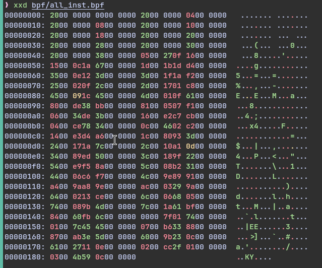
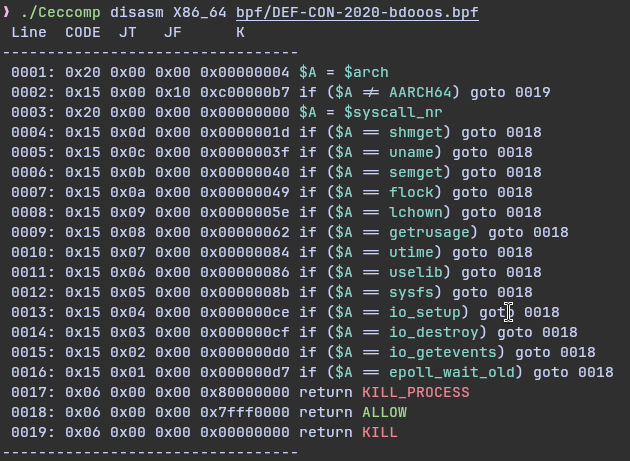
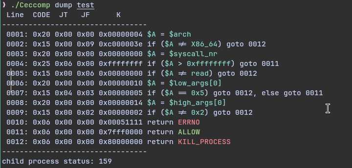
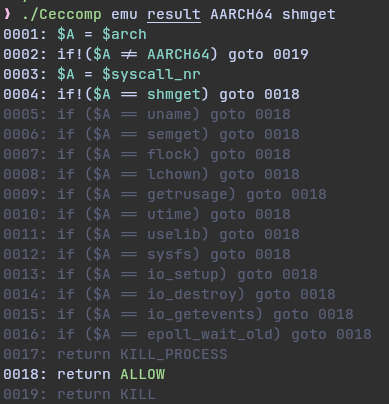
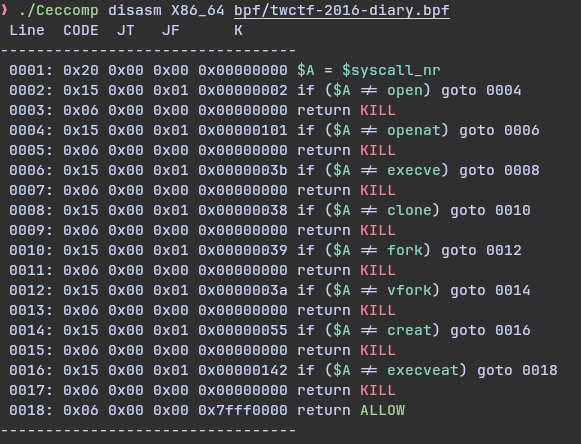
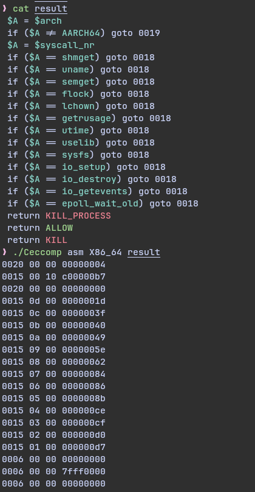

# Ceccomp
A tool to resolve seccomp just like seccomp-tools, written in c
All functions are done.
Yet, still need to test.

## Code to be done

- [x] dump
- [x] emu
- [x] disasm
- [x] asm

## Doc

> some concept to be clear

Kernel load the raw `bpf` to enable seccomp
Raw `bpf` might look like this

After Ceccomp resolve the `bpf`
Ceccomp will print it to `human readable text`
Might look like this

I will call the `human readable text` with `text` later

**So be sure to understand what `text` and `bpf` means**

### Ceccomp dump program [ program-args ]

#### what dump does

Dump mode can dump program `bpf` out
And print it out to `text`

#### what dump looks like

#### dump usages

Find a program that will load seccomp
Do `Ceccomp dump program`

Add program-args if necessary

### Ceccomp emu text arch nr [ argv[0] - argv[5] ] (default as 0)

#### what emu does

Emulate what will happen if `syscall (nr, args ...)` were called
Result file are human readable text(from dump mode or disasm mode)

It can be great when you don't want to read `text`

#### what emu looks like

#### emu usages

`arch` must be specified
Otherwise the Ceccomp can't transfer something like `write` to its syscallnr

## Ceccomp disasm arch xxx.bpf

#### what disasm does

Disasm can transfer `bpf` to text

#### what disasm looks like

#### disasm usages

> Ceccomp disasm arch xxx.bpf

Just like emu, arch must be specified

Then just add the `bpf` you want to resolve

It can be usefule when the program don't load seccomp at once
And you will have to use gdb to get the raw `bpf` manualy
Disasm will do the rest for you

## Ceccomp asm arch asmcodefile

#### what asm does

Asm the `bpf` from `text`

#### what asm looks like

yeah, it might look too simple
I designed asm this way
So copy `bpf` will be easier

#### asm usages

> Ceccomp asm arch text

Just like disasm, emu, `arch` must be specified

Then add the `text`, you can write you own `text`
And asm will transfer `text` to `bpf`

It could be useful when you need to write your own seccomp
(but make sure you write the asm in correct way
I might write a simple guide about what you can write and what you cann't)

## Supported architecture
- X86
- X86-64
- X32
- ARM
- AARCH64
- MIPS
- MIPSEL
- MIPSEL64
- MIPSEL64N32
- PARISC
- PARISC64
- PPC
- PPC64
- PPC64LE
- S390
- S390X
- RISCV64
